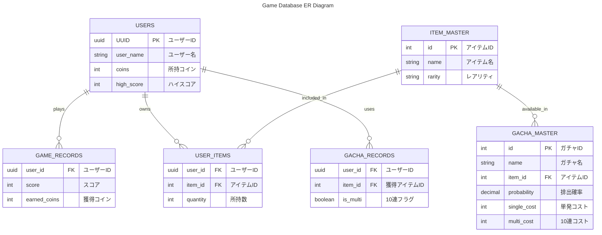

```mermaid
---
title: Game Database ER Diagram
---
erDiagram
    USERS ||--o{ GAME_RECORDS : "plays"
    USERS ||--o{ USER_ITEMS : "owns"
    USERS ||--o{ GACHA_RECORDS : "uses"
    ITEM_MASTER ||--o{ USER_ITEMS : "included_in"
    ITEM_MASTER ||--o{ GACHA_MASTER : "available_in"
    
    USERS {
        uuid UUID PK "ユーザーID"
        string user_name "ユーザー名"
        int coins "所持コイン"
        int high_score "ハイスコア"
    }

    GAME_RECORDS {
        uuid user_id FK "ユーザーID"
        int score "スコア"
        int earned_coins "獲得コイン"
    }

    USER_ITEMS {
        uuid user_id FK "ユーザーID"
        int item_id FK "アイテムID"
        int quantity "所持数"
    }

    ITEM_MASTER {
        int id PK "アイテムID"
        string name "アイテム名"
        string rarity "レアリティ"
    }

    GACHA_MASTER {
        int id PK "ガチャID"
        string name "ガチャ名"
        int item_id FK "アイテムID"
        decimal probability "排出確率"
        int single_cost "単発コスト"
        int multi_cost "10連コスト"
    }

    GACHA_RECORDS {
        uuid user_id FK "ユーザーID"
        int item_id FK "獲得アイテムID"
        boolean is_multi "10連フラグ"
    }
```