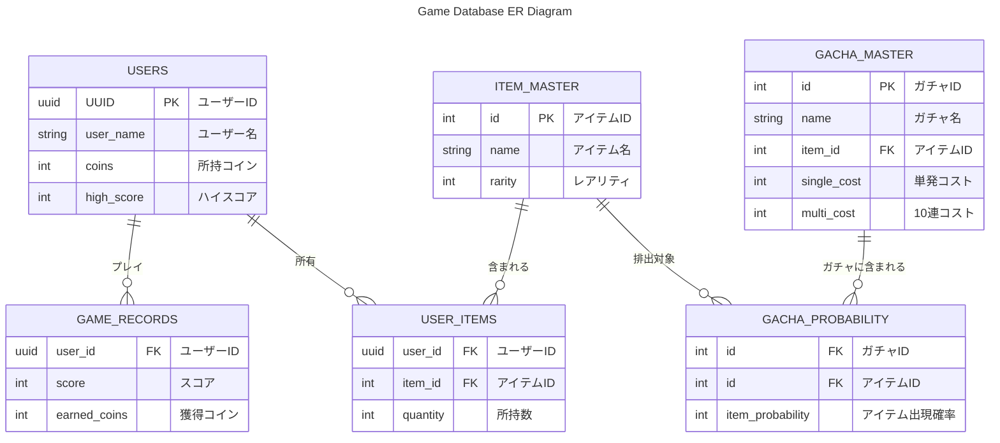

```mermaid
---
title: Game Database ER Diagram
---
erDiagram

    USERS ||--o{ GAME_RECORDS : "プレイ"
    USERS ||--o{ USER_ITEMS : "所有"
    ITEM_MASTER ||--o{ USER_ITEMS : "含まれる"
    GACHA_MASTER ||--o{ GACHA_PROBABILITY : "ガチャに含まれる"
    ITEM_MASTER ||--o{ GACHA_PROBABILITY : "排出対象"
    
    USERS {
        uuid UUID PK "ユーザーID"
        string user_name "ユーザー名"
        int coins "所持コイン"
        int high_score "ハイスコア"
    }

    GAME_RECORDS {
        uuid user_id FK "ユーザーID"
        int score "スコア"
        int earned_coins "獲得コイン"
    }

    USER_ITEMS {
        uuid user_id FK "ユーザーID"
        int item_id FK "アイテムID"
        int quantity "所持数"
    }

    ITEM_MASTER {
        int id PK "アイテムID"
        string name "アイテム名"
        int rarity "レアリティ"
    }

    GACHA_MASTER {
        int id PK "ガチャID"
        string name "ガチャ名"
        int item_id FK "アイテムID"
        int single_cost "単発コスト"
        int multi_cost "10連コスト"
    }
    GACHA_PROBABILITY {
        int id FK "ガチャID"
        int id FK "アイテムID"
        int item_probability "アイテム出現確率"
    }
```